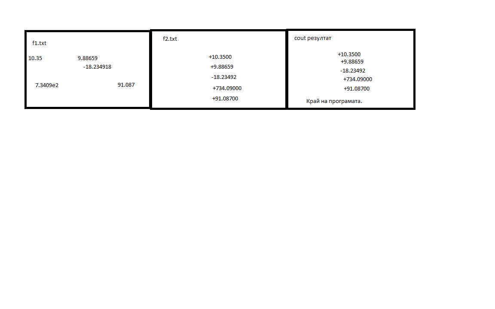

# Задачи за практикум

## Задача 1
Да се дефинират операторите >> и << за следния клас

```C++
class gcd {
    private:
        int x, y;

    gcd(int a, int b) {
        x = a;
        y = b;
    }

    int value() const {
        if(y == 0) {
            return x;
        } else {
            gcd t(y, x % y);
            return t.value();
        }
    }
};
```
намиращ най-големия общ делител на две цели неотрицателни числа, поне едното от които е различно от 0;

## Задача 2
да се напише програма, която чете от текстовия файл f1.txt реални числа, записва ги в нов текстов файл f2.txt и ги извежда на екрана във форматиран вид, показан в приемра по-долу. Броят цифри след десетичната точка и широчината на полето се задават.
Пример


## Задача 3
Да се напише програма, която сгъстява текстов файл, като изтрива всички интервали в него